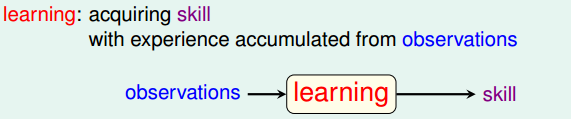
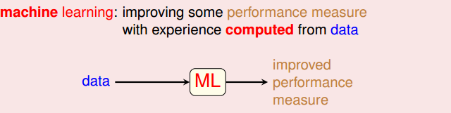
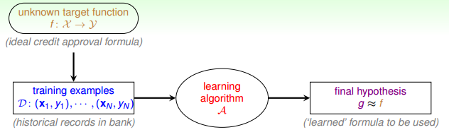

### 1\. What is machine learning?
&ensp;&ensp;&ensp;&ensp;人类学习是通过大量的观察进而积累经验，掌握某些技能或者能力。\
\
&ensp;&ensp;&ensp;&ensp;机器学习，实际上就是让计算机像人类一样，可以自动习得某些技能。说专业点，就是，让计算机通过观察大量的数据和训练，寻得某些模式，来自动习得某些skill。这里的skill主要是指的是系统的某些性能，比如说准确率之类的。总结一下，就是让计算机根据数据来总结经验，找出某种规律或模式，并用它来解决实际问题。\
\
&ensp;&ensp;&ensp;&ensp;使用机器学习的场景：\
（1）事物本身存在某种潜在的规律或模式\
（2）某些问题靠规则性的编程难以解决：比如说声音、图像的识别\
（3）有大量样本可供使用
### 2\. Application of machine learning
&ensp;&ensp;&ensp;&ensp;机器学习在衣食住行育乐方面有广泛的应用。比如说根据twiter上的数据来分析餐厅食物中毒的可能性；根据销售数据和用户调查来做服装搭配的推荐系统；根据建筑物特征及其负荷来预测其他建筑物的负荷；准确识别交通信号灯；根据学生在学习系统上的学习问答记录来预测学生答对某一到新题的可能性；根据用户喜欢的电影，来做电影推荐系统等。
### 3\. Components of Machine Learning
&ensp;&ensp;&ensp;&ensp;基本的符号约束如下：\
（1）输入数据x\
（2）输出y，也就是输入数据的label\
（3）目标函数f，是实际样本的真实分布\
（4）假设h，一个model对应很多h，最佳的称为g，g能最好地表示事物的内在规律，使其接近于f。\
&ensp;&ensp;&ensp;&ensp;机器学习的流程总结如下：
可供训练的样本D，是由理想的目标函数f产生的，我们并不知道f具体是什么，我们需要根据先验知识选择模型，该模型有很多的假设集合H，H中包好了很多假设，通过算法在样本上不断学习，使其更接近于真实样本的产生，进而选出一个最好的假设，该假设对应的表达式g就是习得的模式。\
