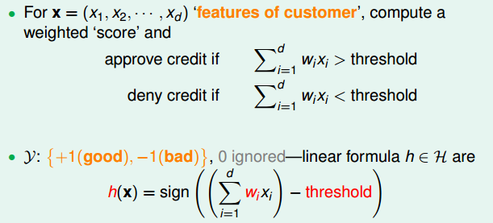
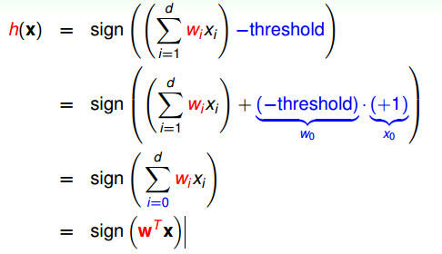
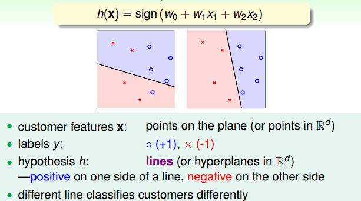
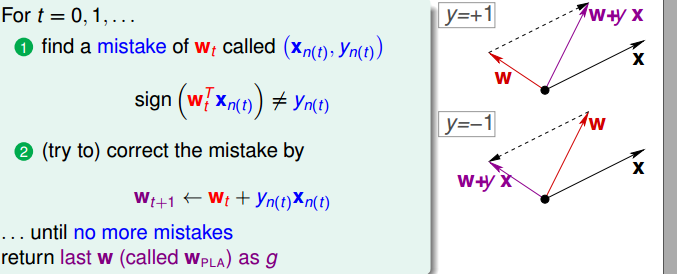
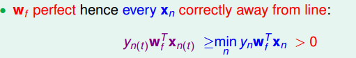
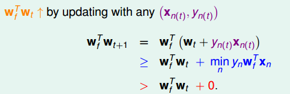
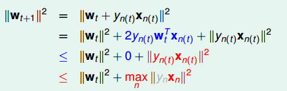
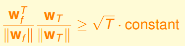
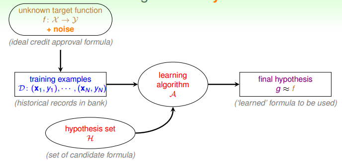
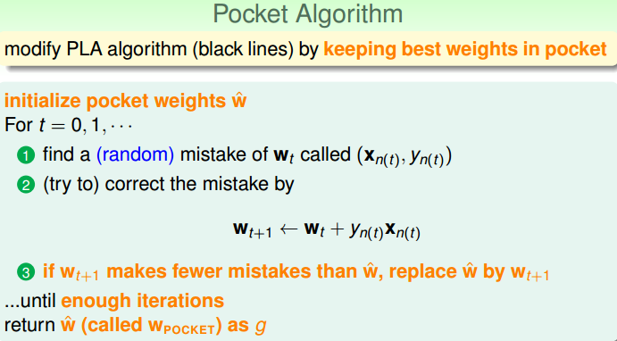

### 1\. Perceptron Hypothesis Set 
&ensp;&ensp;&ensp;&ensp;举一个例子：某银行要根据用户信息来决定是否要给申请的用户发放信用卡来获得尽可能多的收益。现在有训练样本D，主要是包括用户的信息和是否发了信用卡。这个问题可以通过机器学习解决，要根据D，选用某一算法A，在H中选择最好的h，得到g，接近目标函数f，然后利用这个习得的模型对新用户进行判断决定是否发放银行卡。本节课主要是基于感知机(Peceptron)进行总结。

&ensp;&ensp;&ensp;&ensp;在是否发放信用卡的例子中，将用户个人信息作为输入数据x，代表的是每个用户的特征，总共有d个，在建立模型的时候，我们给予每个特征不同权重，表示的是该特征对输出影响程度。将所有的特征加权和的值和一个阈值threshold进行比较，如果大于这个阈值，输出为+1，即发信用卡；反之不发。

&ensp;&ensp;&ensp;&ensp;为了表示方便，我们将阈值当做，于是})可以表示为：

&ensp;&ensp;&ensp;&ensp;以二维为例，该感知机模型在二维平面上就是一个分类的直线，直线一侧是+1，另一侧是-1，其中权重向量则是这个直线的垂直线，即法向量。感知机线性分类在高纬空间中，则是超平面。\

### 2\. Perceptron Learning Algorithm (PLA)
&ensp;&ensp;&ensp;&ensp;假设集合H包含了许多假设h，在PLA中指的就是hypothesis set由许多条直线构成。通过算法A在数据上不断学习来选择一个最好的分界面，将样本尽可能地分正确。\
&ensp;&ensp;&ensp;&ensp;在这里，主要是通过逐点修正的方法来寻找最佳的分界面。以二维平面为例，在平面上随意取一条直线，看看哪些点分类错误。然后开始对第一个错误点就行修正，即变换直线的位置，使这个错误点变成分类正确的点。接着，再对第二个、第三个等所有的错误分类点就行直线纠正，直到所有的点都完全分类正确了，就得到了最好的直线。这种“逐步修正”，就是PLA思想所在。寻找到最佳的分界面。

如何修正正样本误分为负样本，即}<0}),和夹角大于90度，其是直线的法向量。一般的修正的方法就是使和夹角小于90度，通常做法就是做选取和构成的的平行四边形作为更新后（下一步）的，如同上图所示。修正负样本误分为正样本原理与其相同。需要注意的是，每次修正直线，可能使之前分类正确的点变成错误点，这是可能发生的。但是没关系，不断迭代，不断修正，最终会将所有点完全正确分类（PLA前提是线性可分的）这种做法的思想是“知错能改”，即所谓的“A fault confessed is half redressed.”

### 3\. Guarantee of PLA
&ensp;&ensp;&ensp;&ensp;关于PLA，我们需要考虑它什么时候可以停下来。在数据集线性可分的条件下，只要所有平面上的点都分类正确就停。针对线性可分的情况，假设有一条直线能满足停止条件，将目标权重记为,对任意一点都满足：

&ensp;&ensp;&ensp;&ensp;PLA会对每次错误的点进行修正，更新权重的值，如果与越来越接近，内积越大，那表示是在接近目标权重，证明PLA是有学习效果的。其内积可以表示为：

&ensp;&ensp;&ensp;&ensp;内积更大，可能是向量长度更大了，不一定是向量间角度更小。所以，还需要证明与向量长度的关系。

&ensp;&ensp;&ensp;&ensp;从上述可知向量增长被限制了，更新过后的权重和原来的不会差别太大。如果令，那么经过T次错误修正后，有如下结论：

推导过程如下：

&ensp;&ensp;&ensp;&ensp;随着T增大，不等式左边的值越来越接近1，该值代表的是与的相似程度。这也就是说不等式的右端也小于等于1，换句话说，迭代次数T是可数的。根据以上证明：随着迭代次数增加，与逐渐接近。而且，PLA最终会停下来，实现对线性可分的数据集完全分类。

## 4\.Non-Separable Data
&ensp;&ensp;&ensp;&ensp;我们知道对于线性可分的数据集，PLA是在有限更新步数下会停止找到最优分界面，但是对于不可分的数据集，前面的推导可能不成立，所以PLA不一定会停下来,所以，PLA虽然实现简单，但存在一定的局限性。再这种情况下，我们如何分析非线性数据呢？我们针对非线性可分的情况，可以把它当成是数据集D中掺杂了一下noise，在实际情况中，我们所接触到的数据集都或多或少地掺杂了noise。非线性可分的数据集的机器学习流程是这样的：

&ensp;&ensp;&ensp;&ensp;对于非线性可分的数据集，我们可以仁慈一点，容许有错误点，不需要将所有样本点都分类正确，我么只选择错误点的个数最少时的权重就好了，这被研究学者证明是NP-hard问题。于是我们可以移花接木，修改在线性可分类型中表现很好的PLA，将其应用到非线性可分数据集中。

&ensp;&ensp;&ensp;&ensp;修改后的PLA称为Packet Algorithm。算法流程总结如下：

（1）初始化权重，计算出在这条初始化的直线中，分类错误点的个数。

（2）更新权重。对错误点进行修正，更新，得到一条新的直线，再次计算其对应的分类错误的点的个数。并与上一步错误点个数比较，取个数较小的直线作为我们当前选择的分类直线。
（3）重复第2步，不断比较当前分类错误点个数与上一步最少的错误点个数比较，选择最小的错误点所对应的权重作为当前最佳权重。

&ensp;&ensp;&ensp;&ensp;二维的数据，我们可以通过肉眼来判断，对于高纬的数据我们一般采取降维的方式，不如利用PCA或者是t-SNE将数据集的维度降到2维，来判断是否可分。修改后的Packet Algorithm是比PLA慢很多的。