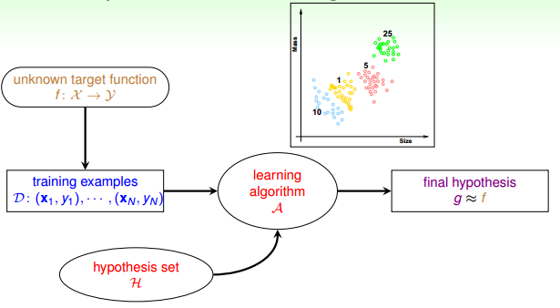
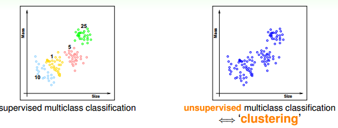
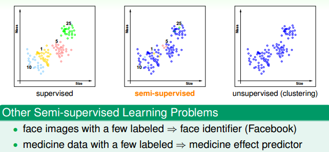
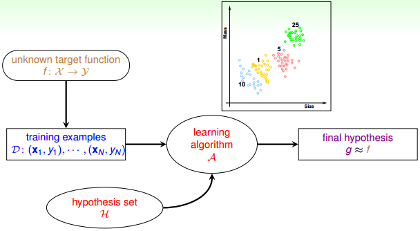
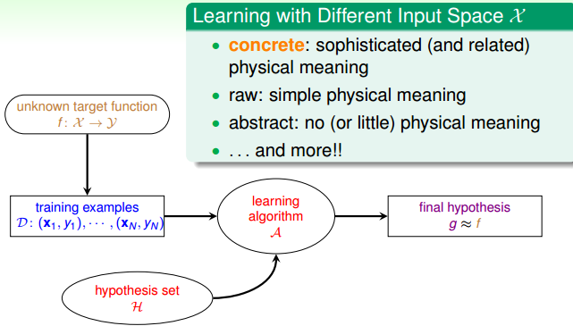

上一节课主要介绍了线性感知机模型，以及解决这类感知机分类问题的简单算法：PLA。并证明了对于线性可分的数据集，PLA可以在有限步数下停下来并实现完全正确分类。对于非线性可分的的数据集，可以使用PLA的修正算法Pocket Algorithm来处理。本节主要是总结归纳机器学习的种类。
## 1\. Learning with Different Output Space 
&ensp;&ensp;&ensp;&ensp;上一节引入的根据用户信息决定是否给用户发放信用卡的例子，是典型的二分类问题，输出的可能值只有两个。二分类的例子在实际生活中还很多，比如判别邮件是否是垃圾邮件、判断一个人是否患病等等。除了二分类问题，也有很多多分类问题，比如手写数字识别等等。针对输出值是离散、可数的这类的机器学习问题，我们统一称之为分类问题，针对输出值是连续的、不可数的这类机器学习问题，我们统一称之为回归问题，例如房价预测、股票收益等等。

## 2\. Learning with Different Data Label 
&ensp;&ensp;&ensp;&ensp;监督式、非监督式、半监督式学习是机器学习领域三个主要类型。\
&ensp;&ensp;&ensp;&ensp;如果数据集D既有输入特征，也有输出标签，那么我们把这种类型的学习称为监督学习；监督式学习可以是二元分类、多元分类或者是回归。

&ensp;&ensp;&ensp;&ensp;如果数据集D只有输入特征，没有输出标签，那么我们把这种类型的学习称为无监督学习；典型的非监督式学习包括：聚类问题，例如异常值检测，文本分类等等。这类问题比较复杂，通常借鉴监督学习的思想。

&ensp;&ensp;&ensp;&ensp;如果数据集中有一部分数据集既有输入特征又有输出标签，而一部分数据集只有输入特征，没有输出标签。

&ensp;&ensp;&ensp;&ensp;除此之外，还有一种非常重要的类型：增强学习。增强学习中，我们给系统一些输入，但是无法表示给出真实的输出y，我们会根据模型的输出做出反馈，如果反馈结果良好，更接近真实输出，就给其正向激励，如果反馈结果不好，偏离真实输出，就给其惩罚，所谓的反向纠正。不断通过“反馈-修正”这种形式，一步一步让模型学习的更好。比如说，我们想让小狗坐下，狗狗并不能听懂，我们需要对他进行训练。在训练过程中，如果它表现得符合我们的要求，我们就给他奖励，如果它做的和命令完全无关的动作，我们就给它小小的惩罚。通过不断修正狗的动作，最终能让它按照我们的指令来行动。
## 3\. Learning with Different Protocol f 
&ensp;&ensp;&ensp;&ensp;按照不同的协议，机器学习可以分为三种类型：Batch Learning，Online Learning，Active Learning。这三种学习类型分别可以类比为：填鸭式，老师教学以及主动问问题。Batch learning是一次性拿到所有的训练数据D，在其上面训练，得到我们最终的机器学习模型；Online Leaning是一种在线学习模型，训练的数据是实时更新的，根据数据一个个进来，同步更新我们的算法，这是一个动态的过程。Active Learning即让计算机具备主动问问题的能力，例如手写数字识别，机器自己生成一个数字或者对它不确定的手写字主动提问。

## 4\. Learning with Different Input Space 
&ensp;&ensp;&ensp;&ensp;上述两种分类是基于输出空间来分类的，这部分总结一下输入有哪些类型。

* concrete features\
&ensp;&ensp;&ensp;&ensp;指的是每一维度的特征都有其具体含义，比如说是否发放信用卡例子中，输入数据是个人信息，比如说年龄、工作年限等都是具有实际物理意义的物理量，我们把这些特征称之为concrete features。oncrete features对机器学习来说最容易理解和使用。
* raw features\
&ensp;&ensp;&ensp;&ensp;指的是比较抽象的特征，比如说手写数字识别中每个数字所在图片的mxn维像素值；比如语音信号的频谱等。我们一般通过一些变换将其转化为concrete features。
* abstract features\
&ensp;&ensp;&ensp;&ensp;指的是完全抽象的特征，比如某购物网站做购买预测时，提供给参赛者的是抽象加密过的资料编号或者ID，这些特征X完全是抽象的，没有实际的物理含义。所以对于机器学习来说是比较困难的，需要对特征进行更多的转换和提取。

