上一节课主要介绍了机器学习的类型。本节课主要讨论机器学习的可行性，讨论问题是否可以使用机器学习来解决。
## 1\. Learning is Impossible
&ensp;&ensp;&ensp;&ensp;首先，考虑这样一个例子，如下图所示

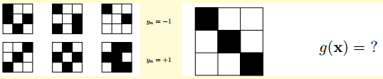

如上图所示，第一排是3个label为-1的九宫格，第二排是3个label为+1的九宫格。根据上述这6个样本，猜猜右边九宫格是属于-1还是+1？如果依据图形是否具备对称性作为特征，我们会把它归为+1；如果依据九宫格左上角是否是黑色，我们会把它归为-1。当然，根据其它不同特征进行分类，还会得到不同的结果。这些分类结果貌似都是正确合理的。

&ensp;&ensp;&ensp;&ensp;再来看下面的例子：输入特征x是二进制的、三维的，对应有8种输入，训练样本总共5个，如图中灰色区域块所示，根据这5个样本如何预测下面3个样本的输出呢？根据训练样本对应的输出y，假设有8个hypothesis，这8个hypothesis在这5个训练样本的分类效果效果都完全正确。但是在另外3个测试数据上，不同的hypothesis表现有好有坏。

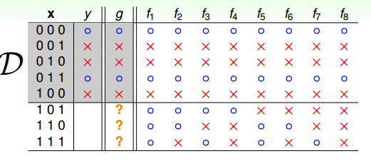

&ensp;&ensp;&ensp;&ensp;上述这个例子告诉我们，我们想要在训练集D以外的数据中更接近目标函数是有点难度的，只能保证对训练集D有很好的分类结果。在机器学习中，这种特性被称为没有免费午餐（No Free Lunch）定理。NFL定理说明了，没有一个通用的学习算法可以在任何领域产生最准确的效果。不管采用何种学习算法，至少存在一个目标函数，能够使得随机猜测算法是更好的算法。平常所说的一个学习算法比另一个算法更“优越”，效果更好，只是针对特定的问题，特定的先验信息，数据的分布，训练样本的数目，代价或奖励函数等。从这个例子来看，NFL说明了不能保证一个机器学习算法在训练集D以外的数据集上一定能分类或预测正确，除非加上一些假设条件。

## 2\. Probability to the Rescue
&ensp;&ensp;&ensp;&ensp;在训练集D以外的样本上，学习到的模型是很难，似乎做不到正确预测或分类的。我们能否用一些工具或者方法对未知的目标函数f做一些推论，使其学习到的模型变得有用呢？\
&ensp;&ensp;&ensp;&ensp;考虑这种情况，假设有一个罐子，里面装有很多橙色球和绿色球，如何推断橙色球的比例？统计学上一般是选择抽样方法，用局部估计整体，从罐子中随机取出N个球作为样本，计算在这N个球中橙色球的比例v，那么就估计出罐子中橙色球的比例约为v。

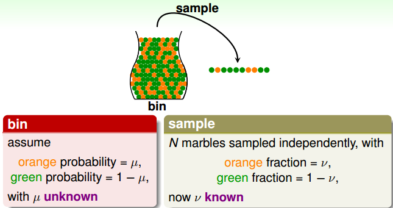

&ensp;&ensp;&ensp;&ensp;用局部估计整体的方法能否说明罐子里橙色球的比例一定是v呢？答案是否定的。反过来，如果从概率的角度来说，样本中的v很有可能接近我们未知的u。下面从数学推导的角度来看v与u是否相近。\
&ensp;&ensp;&ensp;&ensp;已知u是罐子里橙色球真实比例，v是N个抽取的样本中橙色球的比例。当N足够大的时候，v接近于u。这就是Hoeffding’s inequality：

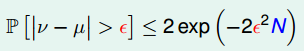

&ensp;&ensp;&ensp;&ensp;&ensp;&ensp;&ensp;&ensp;Hoeffding inequality说明当N很大的时候，v与u相差不会很大，二者的差值限定在一定范围之内，因此可以根据v来推断u。把v=u称为probably approximately correct(PAC)。

## 3\. Connection to Learning
&ensp;&ensp;&ensp;&ensp;同样的思想，我们引入到机器学习上来。我们将上面的例子和机器学习问题进行类比。机器学习中我们训练出来的hypothesis与目标函数相等近似的可能性，类比罐子中橙色球的概率问题。罐子里的一各个小球比于机器学习样本x；橙色的球类比于h(x)与f不相等；绿色的球比于h(x)与f相等；随机抽样，从罐子中抽取的N个球类比于机器学习的训练样本D，且这两种抽样的样本与总体样本之间都是独立同分布的。所以呢，如果样本N够大，且是独立同分布的，根据从样本中推得的h(x)不等于f(x)的概率就能推导在抽样样本外的所有样本中h(x)不等于f(x)的概率是多少。

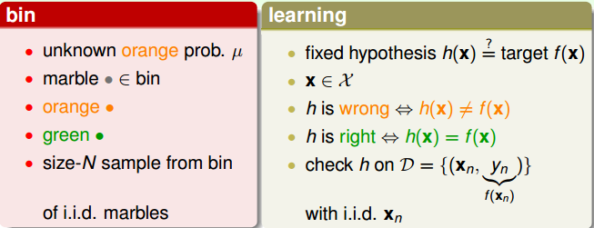

&ensp;&ensp;&ensp;&ensp;在类比的过程中，最关键的点是将随机抽样中橙球的概率理解为样本数据集D上h(x)错误的概率，进而推算出在所有数据上h(x)错误的概率，这也是机器学习work的本质，即我们为啥在采样数据上得到了一个假设，就可以推到全局呢？因为两者的错误率是PAC的，二者近乎相等。

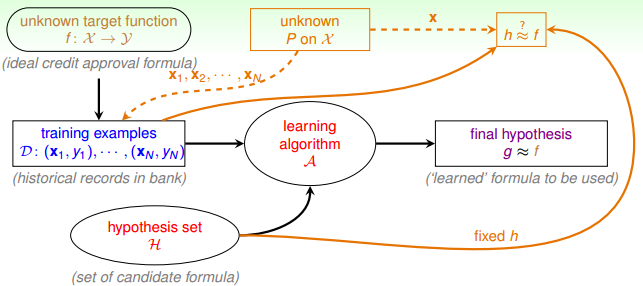

&ensp;&ensp;&ensp;&ensp;我们引入两个值)和)。)表示在抽样样本中，h(x)与yn不相等的概率；)表示实际所有样本中，h(x)与f(x)不相等的概率是多少。类似地，二者的Hoeffding’s inequality可以表示为

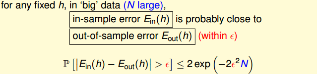

&ensp;&ensp;&ensp;&ensp;不等式表明二者是PAC的。在该数据分布下，h与f非常接近，训练出来的模型比较准确。一般地，h如果是固定的，N很大的时候，即使Ein(h)≈Eout(h)，但并不能够说明g≈f。原因是h固定了，不能保证Ein(h)足够小，即使Ein(h)≈Eout(h)，也可能使Eout(h)偏大。所以，一般会通过算法A，选择最好的h，使Ein(h)足够小，从而保证Eout(h)很小。固定假设h，在未训练过的数据上进行测试，验证其错误率是多少。

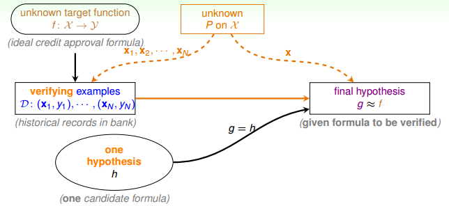

## 4\. Connection to Real Learning
&ensp;&ensp;&ensp;&ensp;假设我们有很多hypothesis，例如有M个hypothesis（类比M个罐子），如果其中某个罐子随机抽样的球全是绿色，那是不是应该选择这个罐子呢？我们先来看这样一个例子：150个人抛硬币，那么其中至少有一个人连续5次硬币都是正面朝上的概率是

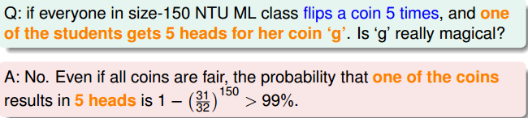

&ensp;&ensp;&ensp;&ensp;通过计算可见这个概率是很大的，但是能说明5次正面朝上的这个硬币具有代表性呢？答案是否定的！因为它并不能说明该硬币单次正面朝上的概率很大，我们知道正反面几率其实都是0.5。同样的道理，随机抽样抽到全是绿色球的情况也不能一定说明那个罐子就全是绿色球。当罐子数目很多或者抛硬币的人数很多的时候，可能会产生Bad Sample，在这里Bad Sample就是Ein和Eout差别比较大的情况，这是由于选择过多导致的。

&ensp;&ensp;&ensp;&ensp;根据多次抽样得到的不同的样本数据集D，Hoeffding’s inequality保证了大多数的样本集都是Good Sample（即对于某个h，保证Ein≈Eout），当然也会存在Bad Sample，这是小概率事件。不同的数据集Dn，对于不同的hypothesis，有可能成为Bad Data。只要Dn在某个hypothesis上是Bad Data，那么Dn就是Bad Data。只有当Dn在所有的hypothesis上都是Good Data，才说明Dn不是Bad Data，可以选择算法A进行建模。那么，根据Hoeffding’s inequality，Bad Data的上界可以表示为如下的形式：

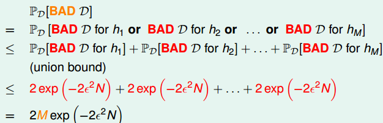

&ensp;&ensp;&ensp;&ensp;在上述中，M是hypothesis的个数，N是D的数量，ϵ是参数。上述表达式说明，当M有限，且N足够大的时候，Bad Data出现的概率就更低了，换句话说就是，可以保证D对于所有的h都有Ein≈Eout，也就是满足PAC，算法A的选择不受限制。那么满足这种上述表达式的情况，可以选取一个合理的演算法（PLA/pocket），选择使Ein最小的hypothesis作为g，一般能够保证g≈f，即有不错的泛化能力。

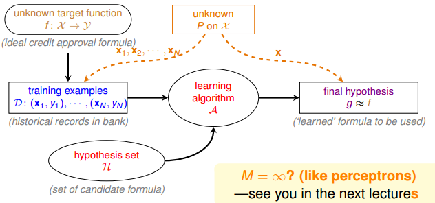

&ensp;&ensp;&ensp;&ensp;总结一下就是，如果hypothesis的个数M是有限的，N足够大，那么通过演算法A任意选择一个g，都有Ein≈Eout成立；同时，如果找到一个矩g，使Ein足够小，接近0，PAC就能保证Eout≈0。至此，就证明了机器学习是可行的。

