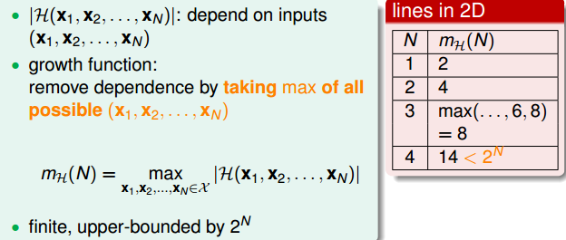

&ensp;&ensp;&ensp;&ensp;在上一节课中，总结到如果hypothesis的个数M是有限的，N足够大，那么通过学习算法A任意选择一个g，都有Ein≈Eout成立；同时，如果找到一个矩g，使Ein足够小，接近0，PAC就能保证Eout≈0。至此，就证明了机器学习是可行的。本节课将严格证明为什么机器可以学习。从上节课的问题出发进行总结，当hypothesis的个数是无限多的时候，机器学习的可行性是否仍然成立？
## 1\. Recap and Preview
&ensp;&ensp;&ensp;&ensp;机器能够学习的前提是训练样本D和测试hypothesis的样本来自同一分布。正如PPT上所描述的那样，当我们的hypothesis sets个数是优先的，训练样本足够大，根据Hoeffding’s inequality，出现Bad Sample的概率是比较小的，这样保证了Ein≈Eout成立，也就是在未训练的新的样本上系统效果依旧表现良好，也就是所谓的泛华能力较好。同时，通过训练，找到使Ein足够小的g，作为模型的最优g，在该g下PAC就能保证Eout足够小，g接近于目标函数f。

前四节课主要内容分别如下：
* 介绍什么是机器学习，机器学习的目标主要是找到最好的g，使g接近于目标函数f，保证Eout(g)≈0。
* 介绍如何让Ein≈0，对于可分数据集，我们采用PLA算法实现，对于不可分数据集，我们采用Pocket等改进算法来实现。
* 介绍机器学习的分类，站在不同的角度，机器学习可以分为不同类型。
* 介绍机器学习的可行性，结合统计学概念，将Ein(g)和Eout(g)联系起来，证明了在一定假设条件下，能够保证Ein(g)≈Eout(g)。

总结下来，可以把机器学习的主要目标分成两个核心的问题：
* Ein(g)≈Eout(g)
* Ein(g)足够小

&ensp;&ensp;&ensp;&ensp;在上一节课中，机器学习可行的一个条件是hypothesis set个数M是有限的，那M跟上面这两个核心问题有什么联系呢？当M很小的时候，由Hoeffding’s inequality可得Ein(g)≈Eout(g)，能保证第一个核心问题成立。但是既然M比较小，那么可供学习算法A学习的hypothesis有限，不一定能保证找到使Ein(g)足够小的hypothesis，也就是不能保证第二个核心问题成立。当M很大的时候，可供学习算法A学习的hypothesis是非常多的，可以能保证找到使Ein(g)足够小的hypothesis，能保证第二个核心问题成立，但是由Hoeffding’s inequality可得，不能保证第一个等式成立。所以综上所述,为了保证两个核心问题都能得到满足，M不能太大，也不能太小。那么如果M无限大的时候，是否机器就不可以学习了呢？例如PLA算法中直线是无数条的，但是PLA能够很好地进行机器学习，这又是为什么呢？

## 2\. Effective Number of Lines
&ensp;&ensp;&ensp;&ensp;我们上节课已经知道Hoeffding’s inequality：

其中M代表的就是Hoeffding’s inequality的个数。每个hypothesis下的BAD events Bm联级的形式满足下列不等式：

当右边的项无限多的时候，远大于左边的，这个上界就变得没有意义了，Ein(g)也不接近与Eout(g)。也就是说BAD events Bm联级扩大了上届，union bound过大。这个上界的估计是基于各个hypothesis之间数据集没有交集的假设情况，这是最坏的情况，可是实际上往往不是如此，很多情况下，都是有交集的，如下图所示。

上界被估计过高了，我们需要找出这些重叠的部分。为了找出重叠的部分，我们将所有的hypothesis分成有限个类别。如何对其进行归类呢？首先举个例子，如果平面上只有一个点x1，那么直线的种类将会有2种：一种将x1划为+1，一种将x1划为-1：

如果平面有两个点x1、x2，那么直线的种类将会有4种：x1和x2同为+1，x1和x2同为-1，x1为+1、x2为-1，x1为-1、x2为+1。

如果平面上有三个点x1、x2、x3，排成三角形，那么直线的种类共8种：

但是如果平面上有三个点x1、x2、x3，排成一条直线，不能保证所有的8个类别都能被一条直线划分，实际上是有6条线，少于8条线。

同理，如果平面上有四个点x1、x2、x3、x4，我们发现，平面上找不到一条直线能将四个点组成的16个类别完全分开，直线最多只有14种：

&ensp;&ensp;&ensp;&ensp;经过分析可得，我们得到平面上线的种类是有限的：有效直线的数量都是小于，N代表的是数据集的个数，于是我们想到用有效的直线的N的数量代替M，那不等式变成：

&ensp;&ensp;&ensp;&ensp;我们知道有效的直线的个数是小于，如果我们能够保证远远小于的话，不等式右边接近于零，那么即使M无限大，直线的种类也很有限，机器学习也是可能的。

## 3\. Effective Number of Hypotheses
&ensp;&ensp;&ensp;&ensp;引入一个新名词：dichotomy（二分类）就是将平面上点分为+1或-1。dichotomy H与hypotheses H的关系是：hypotheses H是平面上将所有数据集进行分开的所有直线的集合，个数可能是无限个，而dichotomy H指的是将数据集分开的所有判别情况，即所谓的是平面上能将点完全用直线分开的直线种类，它的上界是。接下来，我们要做的就是尝试用dichotomy代替M。

&ensp;&ensp;&ensp;&ensp;引入一个新名词：成长函数（growth function），记为m_H(H),对应的是最大的dichotomy的值，也就是有效直线的数量的最大值，其上界就是

&ensp;&ensp;&ensp;&ensp;如何计算成长函数？一维情况，可以表示为：

&ensp;&ensp;&ensp;&ensp;若有N个点，则整个区域最多可分为N+1段，很容易得到其成长函数m_H(N)=N+1。注意当N很大时，(N+1)<<，这是我们希望看到的。

&ensp;&ensp;&ensp;&ensp;成长函数可以由下面推导：

再来看这个例子，假设在二维空间里，如果hypothesis是凸多边形或类圆构成的封闭曲线，如下图所示，左边是convex的，右边不是convex的。那么，它的成长函数是多少呢？

&ensp;&ensp;&ensp;&ensp;当数据集D按照如下的凸分布时，我们很容易计算得到它的成长函数为。这种情况下，N个点所有可能的分类情况都能够被hypotheses set覆盖，我们把这种情形称为shattered。也就是说，如果能够找到一个数据分布集，hypotheses set对N个输入所有的分类情况都做得到，那么它的成长函数就是。

## 4\. Break Point
&ensp;&ensp;&ensp;&ensp;4中不同的成长函数，分别是：

其中，positive rays和positive intervals的成长函数都是多项式级别的的，如果用成长函数代替M的话，这两种情况是比较好的。而convex sets的成长函数是指数级别的的，即等于M，并不能保证机器学习的可行性。那么，对于2D perceptrons，它的成长函数究竟是polynomial的还是exponential的呢？

&ensp;&ensp;&ensp;&ensp;对于2D perceptrons，3个点的情况，可以做出8种所有的dichotomy，4个点就无法做出所有16个点的dichotomy了。所以，我们就把4称为2D perceptrons的break point（5、6等都是break point）。令有k个点，如果k大于等于break point时，它的成长函数一定小于2的k次方。\
&ensp;&ensp;&ensp;&ensp;根据break point的定义，我们知道满足成长函数不等于的k的最小值就是break point。上述总结的4种成长函数，他们的break point分别是：

&ensp;&ensp;&ensp;&ensp;根据分析，我们可以有这样的猜想：对于convex sets，没有break point，它的成长函数是2的N次方；对于positive rays，break point k=2，它的成长函数是O(N)；对于positive intervals，break point k=3，它的成长函数是O()，则根据这种推论，我们猜测2D perceptrons，它的成长函数等于O()。如果成立，那么就可以用mHmH代替M，就满足了机器能够学习的条件。