这一节课主要总结计算机是如何做到举一反三的。从上一节的问题出发，探讨成长函数的增长速度以及是否可以取代M？
## 1\. The Four Break Points
&ensp;&ensp;&ensp;&ensp;成长函数指的是hypothesis sets在N个点的时候最多有多少种dichotomy（也就是+1 -1排列组合）的情况，实际上也代表的是有效直线的数量。我们已经知道4种成长函数和break point之间的关系，如下图：

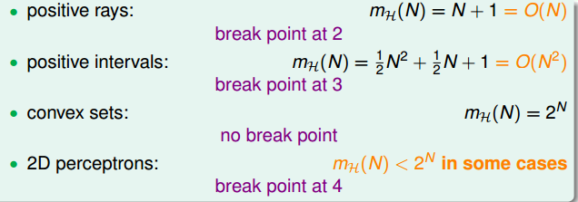

&ensp;&ensp;&ensp;&ensp;我们能否根据成长函数和break point之间的关系来给我们的不等式加上更强的限制？

考虑一个问题，当break point为2时，当N取不同值的时候，其成长函数为多少？我们知道，当N=1时，也就是只有一个点的时候，成长函数为2，当N=2时，任意两点都不能被shattered（shatter的意思是对N个点，能够分解为2的N次方种dichotomies），成长函数为3,；当N=3时，简单绘图分析可得其成长函数为4。

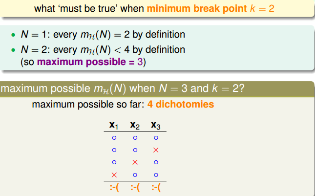

所以，我们发现当N>k时，break point限制了成长函数值的大小，也就是说影响成长函数的因素主要有两个：
* 抽样数据集N
* break point

&ensp;&ensp;&ensp;&ensp;如果给定N和k，能够证明其成长函数的最大值的上界是多项式的，则根据霍夫丁不等式，就能用成长函数代替M，得到机器学习是可行的。证明成长函数的最大值值的上界是poly(N)，是我们的目标。

## 2\. Bounding Function:Basic Cases
&ensp;&ensp;&ensp;&ensp;我们引入一个新的函数：bounding function，B(N,k)。Bound Function指的是当break point为k的时候，成长函数可能的最大值。也就是说B(N,k)是成长函数的上界，对应成长函数最多有多少种dichotomy。所以，我们只需要证明：

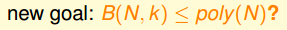

&ensp;&ensp;&ensp;&ensp;B(N,k)的引入只是关注成长函数的上界是多少，从而简化了问题的复杂度。

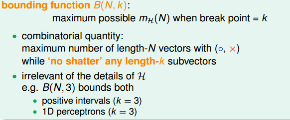

求解B(N,k)的过程，经分析可以表述为：
* 当k=1时，B(N,1)恒为1。
* 当N < k时，根据break point的定义，很容易得到B(N,k)=2的N次幂。
* 当N = k时，此时N是第一次出现不能被shatter的值，所以最多只能有2的N次方-1个dichotomies，则B(N,k)=2的N次方减1。

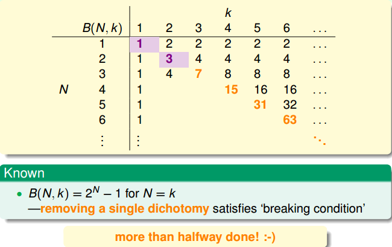

## 3\. Bounding Function: Inductive Cases 

&ensp;&ensp;&ensp;&ensp;N > k的情况较为复杂，下面给出推导过程：
&ensp;&ensp;&ensp;&ensp;以B(4,3)为例，首先想着能否构建B(4,3)与B(3,x)之间的关系：
首先，把B(4,3)所有情况写下来，共有11组。也就是说再加一种dichotomy，任意三点都能被shattered，11是极限。

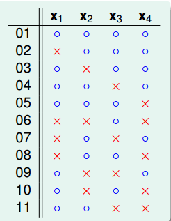

&ensp;&ensp;&ensp;&ensp;对这11种dichotomy分组，目前分成两组，分别是orange和purple，orange的特点是，x1,x2和x3是一致的，x4不同并成对，例如1和5，2和8等，purple则是单一的，x1,x2,x3都不同，如6,7,9三组。

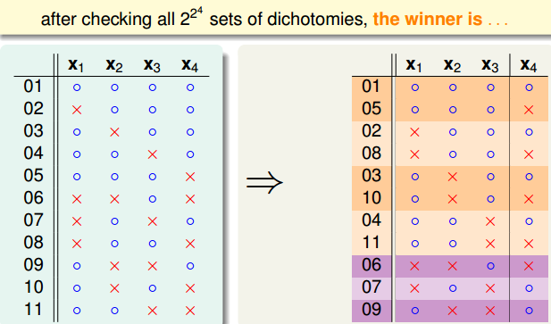

&ensp;&ensp;&ensp;&ensp;将Orange去掉x4后去重得到4个不同的vector并成为αα，相应的purple为β。那么B(4,3)=2α+β，这个是直接转化。紧接着，由定义，B(4,3)是不能允许任意三点shatter的，所以由α和β构成的所有三点组合也不能shatter（α经过去重），即α+β≤B(3,3)。

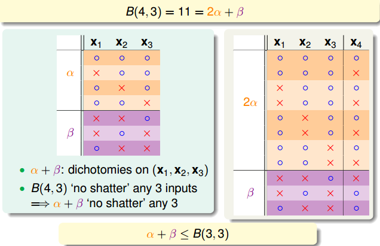

&ensp;&ensp;&ensp;&ensp;另一方面，由于α中x4是成对存在的，且α是不能被任意三点shatter的，则能推导出α是不能被任意两点shatter的。这是因为，如果α是不能被任意两点shatter，而x4又是成对存在的，那么x1、x2、x3、x4组成的α必然能被三个点shatter。这就违背了条件的设定。这个地方的推导非常巧妙，也解释了为什么会这样分组。此处得到的结论是α≤B(3,2)。

由此得出B(4,3)与B(3,x)的关系为：

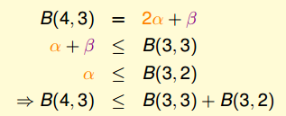

以此类推，推导出一般公式为：

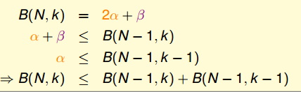

根据推导公式，将表填完整：

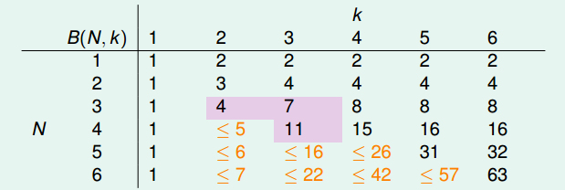

根据递推公式，推导出B(N,K)满足下列不等式：

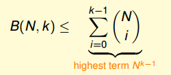

&ensp;&ensp;&ensp;&ensp;上述不等式的右边是最高阶为k-1的N多项式，也就是说成长函数mH(N)的上界B(N,K)的上界满足多项式分布poly(N)，这就是我们想要得到的结果。
